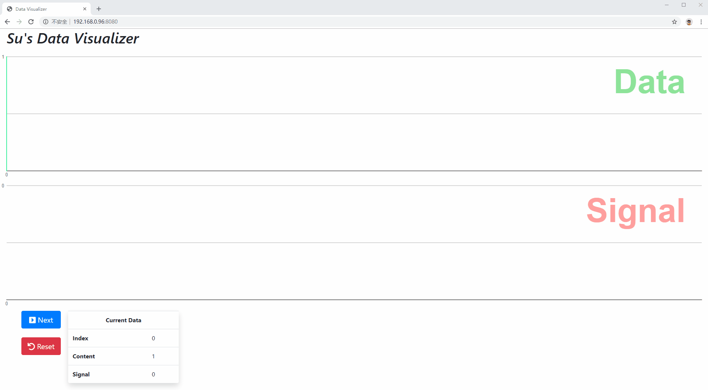

# Su's Data Visualizer

<center>
  
</center>

## Intro

A quick 1 day Code-Challenge demo to show _'my way'_ to implemente a simple Data Visualization tool. It's made of a simple backend (nodejs) and a React + Redux frontend. For the visualization I choose [Raphael js](https://dmitrybaranovskiy.github.io/raphael/), For the Souce Code transcompiling I use Webpack.

## DoD

_(Definition of Done)_
- I think a proper demo for async communication between backend and frontend is still a very important part. So the finish product should have a proper structure made of front / backend which communicate with each other through `XMLHttpRequest`.
- In this demo there should be some minimal user interaction to demonstrate the communication between user <-> this App, Frontend <-> Backend, React <-> Redux and different React Components.
- For the purpose of this test, `Redux` as state machine is definitive a _"over-kill"_, but a basic usage of it here will show if or not I can understand / use it well. So I use redux here.
- I will use the "React Class Component", because this is what I did since 2016, and I'm very comfortable with it. There are "React Functional Component" out since 2018. I've spent some time with it. Source Code written with it is more readable and divide state logic handling from view easier, but as the React doc specified, they do not suggest developer to rewrite there exist Compoenent with it. I believe it's still a big bonus if someone can write and understand the old one, because there are already many React Component implemented with it.
- Because of the time limitation, I won't write unit test for any thing here. But I will if later on it's needed from someone or I happen to have the motivation and time for it.
- The finish product will made of two parts as above said. The backend will be started with `node`. For the frontend I difine a dev version of it which is transcompiled from `webpack` and hosted in `webpack-dev-server` should be good enough for demo purpose. Although I've setup a `build` script, which will build the actual app (through `npm run build`).


## Getting Started

This project is made of two repository - Front- / Backend.
First download both Repos:
```sh
mkdir -p ~/workspace/data_visualizer
cd $_
git clone https://github.com/Gfast2/dataVisualizer_backend_demo.git
git clone https://github.com/Gfast2/dataVisualizer_frontend_demo.git
```
Then install all needed packages:
```sh
cd ~/workspace/data_visualizer/dataVisualizer_frontend_demo
npm i
```
Start both front and backend in different console:

Frontend:
```sh
cd ~/workspace/data_visualizer/dataVisualizer_frontend_demo
npm run dev
```
Backend:
```sh
cd ~/workspace/data_visualizer/dataVisualizer_backend_demo/
npm start
```
Lastely open your browser and visit url:
```sh
<hostIP>:8080
```

**P.s.:**
Make sure port 8080 and 8081 are free on your machine. Here is the setup I used

|Part   | Type & Version                         |
|-------|----------------------------------------|
|host OS| Ubuntu Mate 18.04.2 64bit i VirtualBox |
|Nodejs | V12.13.0                               |
|Npm    | 6.12.0                                 |
|Browser| V77.0.3865.75                          |
|User OS| Windows 10 HOME 1809 17763.805         |

